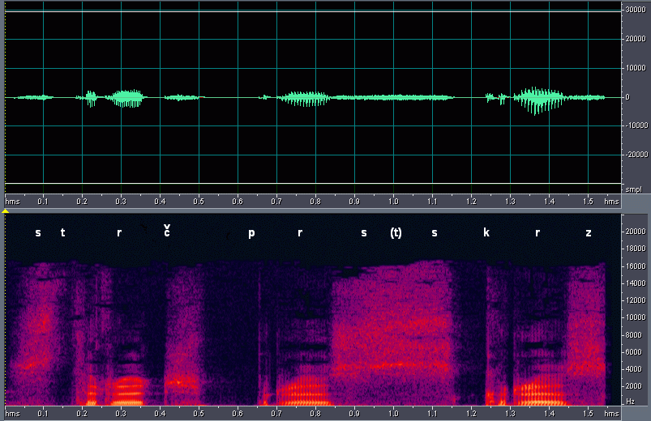

# GenuinoMusic2.0

Su funcionamiento es sencillo, selecciona una **canción** de su base de datos e identifica su **género**

utiliza las **librerías** de **keras ** y  **tensorFlow ** para el manejo de las neuronas, y su entrenamiento

estudia el **espectrograma** del audio(FIGURA 1.0)

figura 1.0
